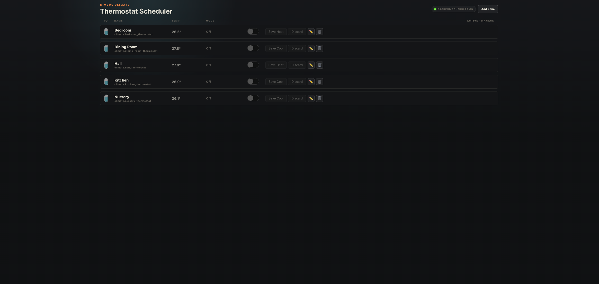
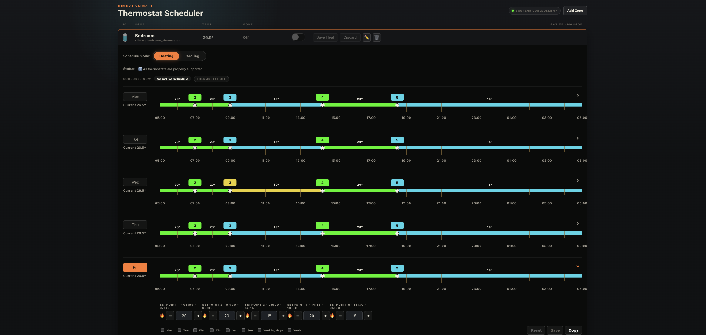
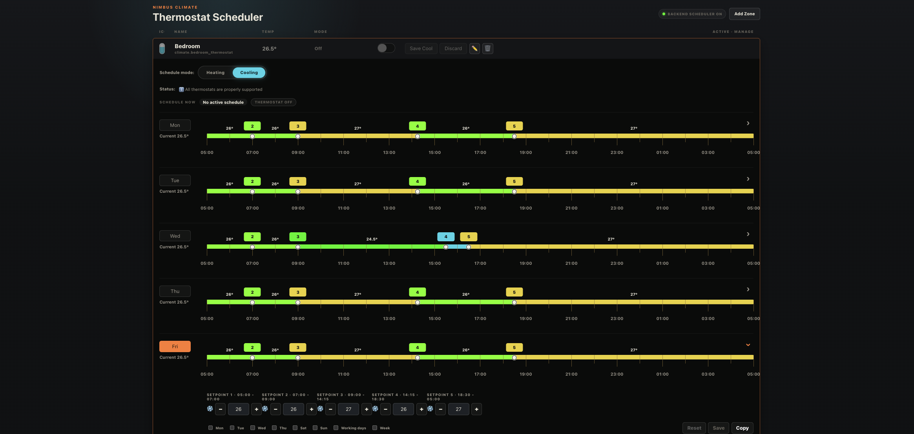
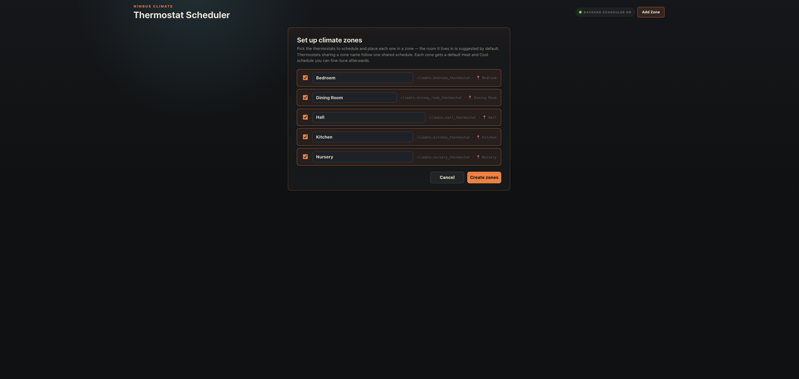
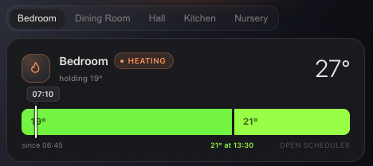
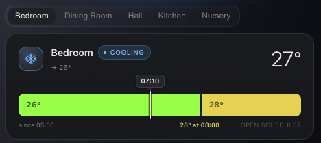
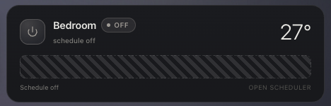

# Nimbus Climate Scheduler

A weekly heating & cooling scheduler for Home Assistant — a full sidebar panel
where you draw each zone's plan on a visual timeline, and a small backend loop
keeps your thermostats on schedule. No automations to write.



| Heating zone | Cooling zone | First‑run setup |
| --- | --- | --- |
|  |  |  |

## Why I made this

For many years a smart-home enthusiast, I've been through many platforms before
dropping my anchor at Home Assistant. On some of the other platforms I really
admired the way they handled the climate / HVAC controller — they let you build
your own weekly schedule plan easily, without putting much effort into it. So I
tried to make the Nimbus Climate Scheduler sidebar integration, to bring to Home
Assistant all those characteristics I love:

- You can handle **heat and cool modes separately**.
- You can save an entire week's schedule by **copying a day** to working days /
  all days / weekends.
- There are **5 setpoints per day**, which you can drag however you like on the
  timeline, and set a cool/heat temperature for each setpoint separately.

Building this around a full-time job in another profession and two toddlers
isn't easy — I've spent a lot of hours debugging. I'd genuinely love your
feedback, and any corrections or additions that make it better are very welcome.

— **@maxfok**

## Dashboard card

Sometimes you just want to know what the heating is supposed to be doing right
now.

The built-in read-only dashboard card shows the current and next setpoints on the
familiar colored schedule timeline, complete with a marker that smoothly follows
the current time throughout the day.

Use it with a single zone for a compact overview, or add multiple zones to get
convenient tabs for quick switching between rooms.



| Cooling | Schedule off |
| --- | --- |
|  |  |

The card loads automatically once the integration is set up — there's no
Lovelace resource to add. Drop it on a dashboard with a single zone:

```yaml
type: custom:nimbus-climate-scheduler-card
entity: climate.nursery_thermostat
```

…or list several zones to get tabs:

```yaml
type: custom:nimbus-climate-scheduler-card
entities:
  - climate.bedroom_thermostat
  - climate.nursery_thermostat
  - climate.kitchen_thermostat
```

Adding it from the dashboard UI works too — it shows up as *Nimbus Climate
Scheduler Card* with a built-in editor. Tap **open scheduler** on the card to
jump to the panel.

> **Companion card** — for full thermostat control (modes, target, live graph)
> see [Nimbus Climate card](https://github.com/maxfok/nimbus-climate-card).

## Under the hood

- **Backend scheduler** — a Home Assistant-side loop (default every 30 s) applies
  the saved schedule via `climate.set_hvac_mode` / `climate.set_temperature`. It
  works with the panel closed, and a disabled zone is left under manual control —
  the scheduler never overrides it.
- **Zones, not just entities** — group several thermostats into one zone with a
  shared schedule; the setup wizard suggests the room (HA Area) each thermostat
  lives in.
- **°C and °F aware** — limits, step and resolution come from each device
  (`min_temp`, `max_temp`, `target_temp_step`); color bands and default schedules
  adapt to your unit system.
- **Mobile friendly** — narrow layout and a sidebar button for phones.
- Schedules persist in HA storage, shared across all your browsers and devices.

## Installation

### HACS (custom repository)

1. HACS → Integrations → ⋮ → *Custom repositories*.
2. Add `https://github.com/maxfok/nimbus-climate-scheduler` as type
   **Integration** and install.
3. Restart Home Assistant.

### Manual

Copy `custom_components/nimbus_climate_scheduler/` into your Home Assistant
`config/custom_components/` folder and restart.

## Setup

Settings → Devices & Services → **Add Integration** → *Nimbus Climate
Scheduler*. Open the **Climate Schedule** panel from the sidebar; on first run a
wizard helps you pick your thermostats and place each one in a zone.

That's it — no YAML required.

## How it works

- The panel saves each zone's schedule to Home Assistant storage over the
  websocket API. Drafts you're still editing are never applied — only what you
  **save**.
- The backend loop resolves the active setpoint for the current time (schedule
  days run 05:00 → 05:00) and only calls a service when the thermostat differs
  from the target, so it won't spam your devices.
- The toggle on each zone enables or disables its schedule. Disabled means
  hands-off: your manual thermostat control is never touched.

## Notes

- Requires Home Assistant 2024.6 or newer.
- Tested at home on Z-Wave thermostats (heat + cool), and on a separate heat-only
  setup. It's a hobby project I run in my own house — use it at your own risk,
  and please open an issue if something misbehaves.

## Development and tests

Backend tests use the Home Assistant custom-component pytest harness:

```bash
uv venv --python 3.14
uv pip install --python .venv/bin/python -r requirements_test.txt
.venv/bin/pytest --cov
```

Frontend card and panel tests use Vitest with jsdom:

```bash
npm ci
npm test
```

Both suites also run automatically for every push and pull request.
